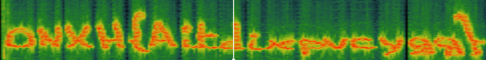

# The hidden message

## Description

File : `perseverance.gif`

At first sight, nothing interesting when looking at the `gif`. But as always, nothing better than a `binwalk` to explore the image more deeply.

```bash
$ binwalk Perseverance.gif
DECIMAL       HEXADECIMAL     DESCRIPTION
--------------------------------------------------------------------------------
0             0x0             GIF image data, version "89a", 668 x 502
12078964      0xB84F74        Zip archive data, at least v1.0 to extract, name: Perseverance - Next Hope/
12079019      0xB84FAB        Zip archive data, at least v1.0 to extract, name: Perseverance - Next Hope/Perseverance - Next Hope/
12080646      0xB85606        Zip archive data, at least v2.0 to extract, compressed size: 37785967, uncompressed size: 37780202, name: Perseverance - Next Hope/Perseverance - Next Hope/The_lasT_T4sk.rar
49867694      0x2F8EBAE       End of Zip archive, footer length: 22
```

Hidden files in image, a classic one.

Let's extract the archive `The_lasT_T4sk.rar`

```bash
$ binwalk -e Perseverance.gif
```

> Sometimes this operation doesn't really work when we have encrypted/protected files to extract. Lucky for me this time it worked :happy:

```bash
$ tree                                                        
.
├── Perseverance.gif
└── _Perseverance.gif.extracted
    ├── B84F74.zip
    └── Perseverance - Next Hope
        └── Perseverance - Next Hope
            ├── Interview_Président-directeur_général_du_CNRS_EN.txt
            ├── Interview_Président-directeur_général_du_CNRS_FR.txt
            └── The_lasT_T4sk.rar
```

Trying to uncompress the archive we are facing with a password issue.

Reading one of the text file we can see morse code on the first and last line wich decoded gives us an hint on the password.

`.- -.- . / .- / --. --- --- -.. / .-.. --- --- -.- / .- - / - .... . / .-.. .- -. -.. .. -. --.` = `TAKE   A   GOOD   LOOK   AT   THE   LANDING`

So I took a look at the landing...

The password was hidden of the third frame after converting the gif in png frames.


`My_StR0n9_4rCh1v3`

After extracting the content of archive, here comes the fun.

The video of perseverance's landing... but with an hidden message. We can literally hear nothing or at least it is not understandable.

Grabbed the audio from the file :

```bash
$ ffmpeg -i Perseverance.mp4 Perseverance.mp3
```

And launched Sonic Visualizer.

`Right-click on the track > Layer > Add Spectogramm`

We play with some settings like:

- `Window : 32768 | 93.75%`
- `Bins : All Bins | Log`

And bam ! Here we go !



`ONXH{Aitdixpvcygg}`

Actually, this is not the flag but it looks like it with some vinegere cipher behind...

If we put this into Cyberchef with the key `CLE` it gives us the real flag :

`MCTF{Perseverance}`.

We could also use [dcode](https://www.dcode.fr/vigenere-cipher) and use the `Knowing a plaintext word` option.

