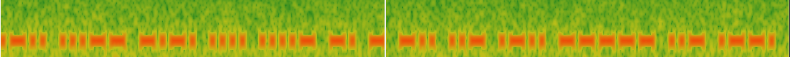

# WWI

## Description

File : `audio.mp3`

Listening to the audio file, it is obviously morse code and the title confirms it by referring to first world war.

Drawing the spectrogram with Sonic Visualiser we got the code.

`.-.. ...-- -.-. .... ....- -. - -.. ..- .-.. ----- ..- .--.` = `L3CH4NTDUL0UP`

Flag : `MCTF{L3CH4NTDUL0UP}`